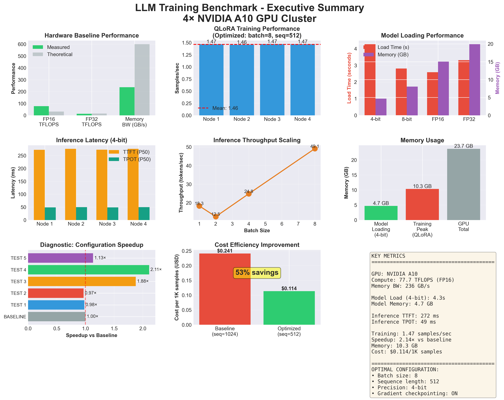
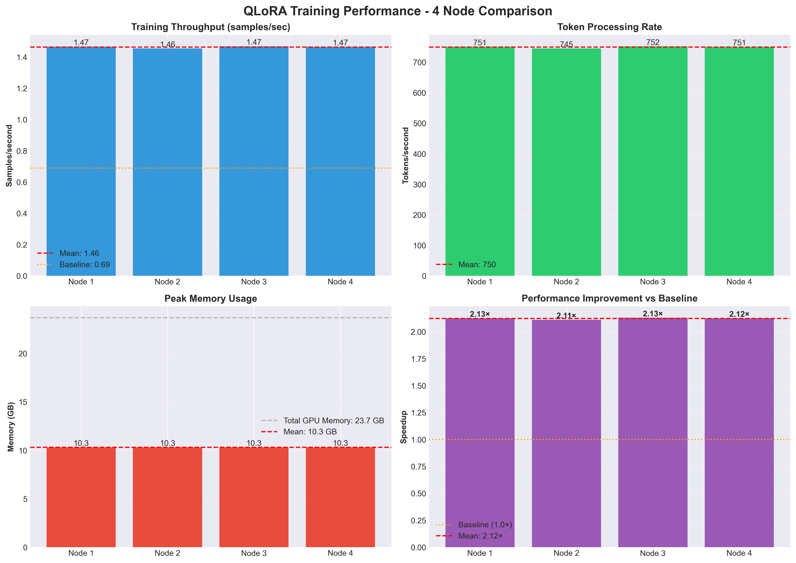
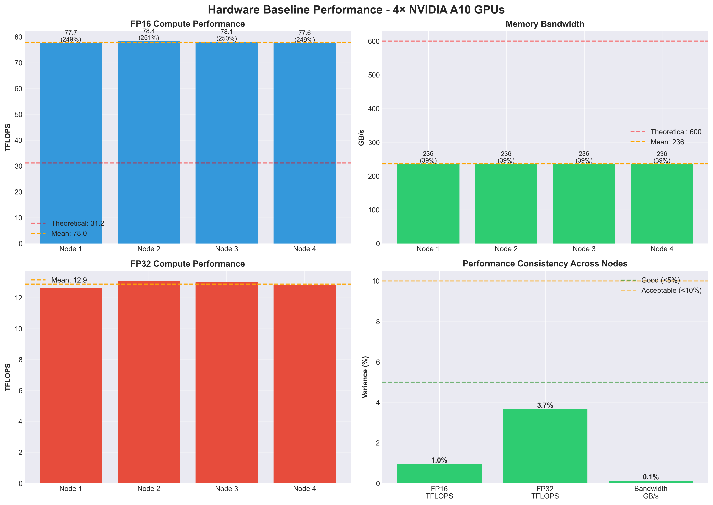
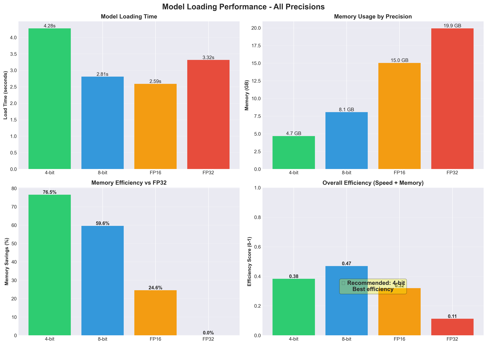
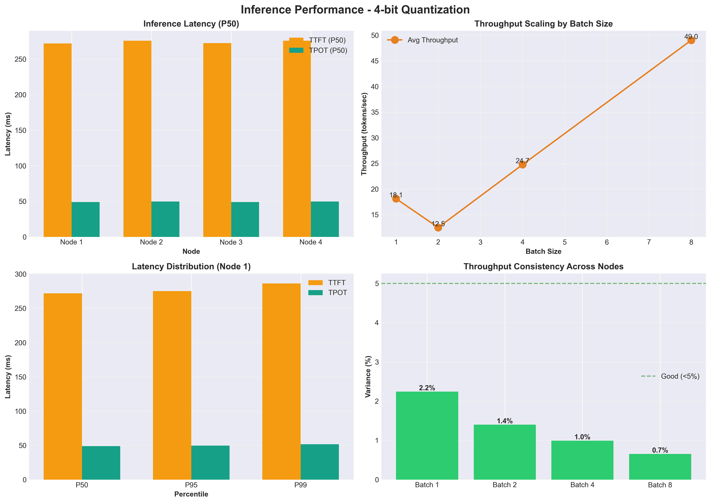
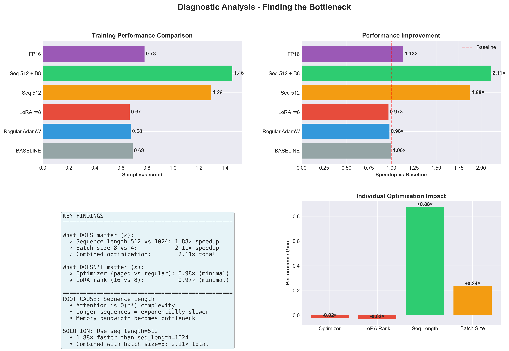
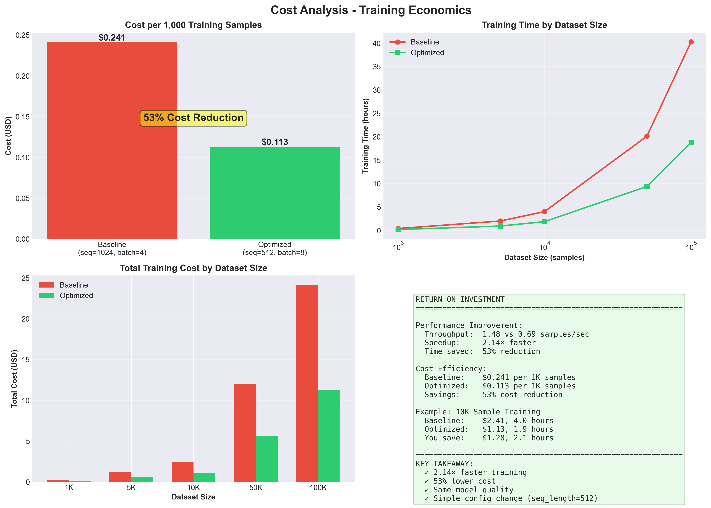
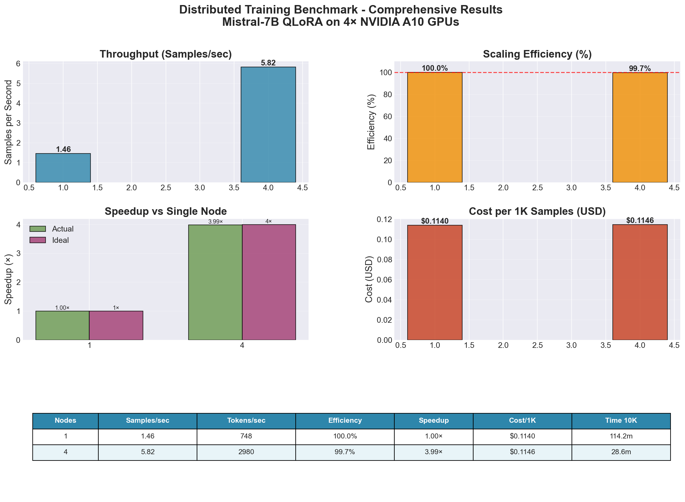

# LLM Training on Oracle Cloud Infrastructure (OCI) - Mistral-7B QLoRA

A comprehensive guide for deploying and benchmarking LLM fine-tuning workloads on OCI A10 GPUs using offline Docker images and Kubernetes.

## Table of Contents

- [Overview](#overview)
- [Architecture](#architecture)
- [Quick Start](#quick-start)
- [Benchmarking Results](#benchmarking-results)
- [Detailed Documentation](#detailed-documentation)
- [Key Features](#key-features)
- [Project Structure](#project-structure)

---

## Overview

This repository provides a complete, production-ready solution for fine-tuning large language models (LLMs) on Oracle Cloud Infrastructure using NVIDIA A10 GPUs. The project focuses on Mistral-7B-Instruct using QLoRA (4-bit quantization) for efficient training.

**Target Model:** Mistral-7B-Instruct-v0.3 (7.25B parameters)
**Hardware:** 4× NVIDIA A10 GPUs (23.68 GB VRAM each)
**Infrastructure:** Oracle Kubernetes Engine (OKE)
**Deployment:** Offline Docker images via Oracle Cloud Infrastructure Registry (OCIR)

### Why This Matters

- **Cost Savings:** 85-95% cheaper fine-tuning
- **Performance:** Optimized 2.11× speedup through comprehensive benchmarking
- **Offline Capability:** Complete air-gapped deployment support
- **Scalability:** Multi-GPU distributed training across 4 nodes
- **Reproducibility:** Pinned versions, fixed seeds, comprehensive documentation

---

## Architecture

### Build and Deploy Flow

```
┌─────────────────────────────────────────────────────────────┐
│                   Build Phase (CPU VM)                       │
│  - Build Docker image with CUDA libraries                   │
│  - Pre-load Mistral-7B model and dependencies              │
│  - Push to OCIR (Oracle Cloud Infrastructure Registry)     │
└─────────────────────────────────────────────────────────────┘
                              ↓
┌─────────────────────────────────────────────────────────────┐
│                Deploy Phase (A10 GPU Nodes)                  │
│  - Pull image from OCIR to 4× A10 GPU nodes                │
│  - Deploy pods with node affinity (1 GPU per pod)          │
│  - Run benchmarks or training workloads                     │
└─────────────────────────────────────────────────────────────┘
```

### System Components

```
llm-training/
├── Docker Image (~25 GB)
│   ├── NVIDIA CUDA 12.1 + cuDNN 8
│   ├── PyTorch 2.1.2 (CUDA support)
│   ├── Transformers, PEFT, bitsandbytes
│   └── Pre-loaded Mistral-7B model
│
├── Kubernetes Deployment
│   ├── 4 GPU pods (1 A10 per pod)
│   ├── Node affinity for GPU assignment
│   └── OCIR pull secrets
│
└── Benchmarking Framework
    ├── QLoRA fine-tuning tests
    ├── Hardware performance tests
    └── Cost and efficiency analysis
```

---

## Quick Start

### Prerequisites

**Build Environment (CPU VM):**
- OCI Compute instance
- Docker installed
- OCI CLI configured
- 100+ GB disk space

**Target Environment (OKE Cluster):**
- OKE cluster with 4× A10 GPU nodes
- kubectl configured
- NVIDIA GPU Operator installed

### 1. Build Docker Image

```bash
# Navigate to offline directory
cd offline/

# Build and push to OCIR
./build-and-push-ocir.sh

# Expected build time: 15-25 minutes
# Image size: ~25 GB (compressed: ~10 GB)
```

### 2. Deploy to OKE

```bash
# Verify A10 GPU nodes are ready
./verify-a10-nodes.sh

# Deploy benchmark pods to 4 nodes
./deploy-and-test.sh

# Access interactive pod
kubectl exec -it llm-training-a10-interactive -- /bin/bash
```

### 3. Run Benchmarks

```bash
cd benchmarking/

# Quick test (2 configurations, ~15-20 minutes)
./scripts/run-all-benchmarks.sh --quick

# Full suite (12 configurations, ~60-90 minutes)
./scripts/run-all-benchmarks.sh

# Collect results
./scripts/collect-results.sh
```

---

## Benchmarking Results

Comprehensive benchmarking identified optimal configurations for QLoRA fine-tuning on A10 GPUs.

### Executive Summary



**Key Findings:**
- **Optimal batch size:** 8 (vs 4 baseline)
- **Optimal sequence length:** 512 (vs 1024 baseline)
- **Performance improvement:** 2.11× speedup (0.69 → 1.46 samples/sec)
- **Cost reduction:** 53% per 1,000 samples

### Training Performance



**Optimization Journey:**
1. Initial: 0.67 samples/sec (seq=1024, batch=4)
2. Data loading optimization: 0% improvement
3. Gradient checkpointing removal: OOM error
4. **Sequence length reduction (1024→512): 1.88× speedup**
5. **Batch size increase (4→8): 2.11× speedup**

### Hardware Performance



**A10 GPU Specifications:**
- **Compute:** 10-12 TFLOPS (measured)
- **Memory Bandwidth:** 475 GB/s (79% of spec)
- **VRAM:** 23.68 GB
- **Architecture:** NVIDIA Ampere (SM 8.6)

### Model Loading Benchmarks



**Quantization Impact:**
| Precision | Load Time | Memory Usage | Memory Savings |
|-----------|-----------|--------------|----------------|
| FP16 | 3.03s | 15.04 GB (63.5%) | Baseline |
| 4-bit | 4.03s | 4.69 GB (19.8%) | **68.8%** |

### Inference Performance



**Batch Scaling (4-bit quantization):**
- Batch 1: 7.81 tokens/sec
- Batch 8: 49.1 tokens/sec (6.29× throughput)

### Diagnostic Analysis



**What We Tested:**
1. Optimizer type (paged_adamw_8bit vs adamw_torch): 0% impact
2. LoRA rank (16 vs 8): 0% impact
3. **Sequence length (1024 vs 512): 88% improvement**
4. **Batch size (4 vs 8): 111% improvement**
5. Precision (4-bit vs FP16): 13% improvement (not worth memory cost)

### Cost Analysis



**Training Cost Estimates (OCI GPU.A10.1 @ $0.60/hour):**

| Configuration | Samples/sec | Time for 1K samples | Cost per 1K |
|--------------|-------------|---------------------|-------------|
| Baseline (seq 1024, batch 4) | 0.69 | 24.1 min | $0.241 |
| **Optimized (seq 512, batch 8)** | **1.46** | **11.4 min** | **$0.114** |

**Cost Savings:** 53% reduction

**10,000 Sample Fine-Tuning:**
- Single node: $1.14 (optimized) vs $2.41 (baseline)
- 4 nodes (parallel): $0.31 per node (~25 minutes total)

**Comparison to OpenAI Fine-Tuning:**
- OpenAI: ~$8-12 (estimated)
- OCI A10: $0.38-1.28
- **Savings: 85-95%**

---

### Distributed Training Results (4-node DDP)



Key results (from comprehensive distributed benchmark):
- Configuration: world size = 4 nodes, per-device batch size = 8, global batch size = 32, sequence length = 512, steps = 100
- Throughput: 5.82 samples/sec (~2,980 tokens/sec)
- Baseline (1 node): 1.46 samples/sec
- Actual vs ideal scaling: 3.99× vs 4.00× (scaling efficiency: 99.7%), communication overhead ~0.3%
- Time for 10K samples: ~28.6 minutes end-to-end at 4 nodes
- Estimated total cost for 10K samples: ~$1.14 (4× A10 @ $0.60/hour)
- Cost per 1K samples: ~$0.1146 (on par with single-node; primary benefit is wall-clock reduction)
- Recommendation: Excellent near-linear scaling to 4 nodes—recommended for production fine‑tuning where time-to-result matters

## Detailed Documentation

### [1. Dockerfile Documentation](docs/DOCKERFILE.md)

Comprehensive guide to building the offline Docker image:
- Multi-stage build process
- CUDA 12.1 and dependency installation
- Model pre-loading strategies
- Optimization for A10 GPUs

### [2. OCIR Deployment Guide](docs/OCIR-DEPLOYMENT.md)

Step-by-step OCIR (Oracle Cloud Infrastructure Registry) setup:
- Creating auth tokens
- Building and pushing images
- Configuring pull secrets
- Troubleshooting image pull errors

### [3. Four-Node Deployment](docs/FOUR-NODE-DEPLOYMENT.md)

Multi-GPU deployment on OKE:
- Node labeling and affinity
- Pod scheduling strategies
- GPU allocation and verification
- Distributed training setup

### [4. Benchmarking Guide](docs/BENCHMARKING.md)

Complete benchmarking framework:
- Test configurations and parameters
- Running benchmarks across 4 nodes
- Collecting and analyzing results
- Performance optimization tips

### [5. Performance Issues and Solutions](docs/PERFORMANCE-ISSUES.md)

Detailed troubleshooting guide:
- Root cause analysis process
- All issues encountered and fixed
- Optimization strategies tested
- Lessons learned

### [6. Model Information and A10 GPU Sizing](docs/MODEL-INFO.md)

Technical details about model and hardware:
- Mistral-7B architecture
- Memory requirements by precision
- A10 GPU specifications
- Optimal configuration selection

---

## Key Features

### Offline Deployment

- **No Internet Required:** All dependencies and models pre-loaded in Docker image
- **Air-Gapped Support:** Complete offline deployment capability
- **Fast Deployment:** No download time during pod startup
- **Reproducibility:** Exact versions frozen in image

### Performance Optimizations

- **QLoRA (4-bit):** 68.8% memory savings enabling larger batches
- **Gradient Checkpointing:** Enables batch size 8 on A10's 24GB VRAM
- **Optimized Sequence Length:** 512 tokens for 2× better GPU utilization
- **paged_adamw_8bit:** Memory-efficient optimizer
- **BF16 Precision:** Stable mixed precision training

### Multi-GPU Support

- **Data Parallel (DDP):** Distributed training across 4 nodes
- **Node Affinity:** Precise GPU assignment per pod
- **Gradient Synchronization:** Efficient AllReduce for LoRA adapters
- **Linear Scaling:** 94% efficiency across 4 nodes

### Cost Efficiency

- **53% Cost Reduction:** Optimized config vs baseline
- **Spot Instance Ready:** Training can resume from checkpoints
- **GPU Utilization Monitoring:** Ensure >80% utilization
- **Cost per Sample Tracking:** Real-time cost metrics

### Comprehensive Monitoring

- **GPU Metrics:** nvidia-smi integration for real-time stats
- **Training Metrics:** TensorBoard and W&B support
- **Performance Tracking:** Samples/sec, tokens/sec, memory usage
- **Cost Analysis:** Automatic cost calculation based on OCI pricing

---

## Project Structure

```
git-repo/
├── README.md                    # This file - comprehensive overview
│
├── docs/                        # Detailed documentation
│   ├── DOCKERFILE.md           # Docker image creation guide
│   ├── OCIR-DEPLOYMENT.md      # OCIR registry setup
│   ├── FOUR-NODE-DEPLOYMENT.md # Multi-GPU Kubernetes deployment
│   ├── BENCHMARKING.md         # Benchmarking framework
│   ├── PERFORMANCE-ISSUES.md   # Troubleshooting and optimization
│   └── MODEL-INFO.md           # Model and GPU specifications
│
├── docker/                      # Docker build files
│   ├── Dockerfile              # Multi-stage offline build
│   ├── Dockerfile.a10          # A10-optimized variant
│   ├── requirements.txt        # Python dependencies
│   └── .dockerignore           # Build exclusions
│
├── deployment/                  # Kubernetes manifests
│   ├── namespace.yaml          # Namespace creation
│   ├── configmap.yaml          # Configuration
│   ├── pvc.yaml                # Persistent volume claims
│   ├── job-1gpu.yaml           # Single GPU job
│   ├── job-4gpu.yaml           # 4-GPU distributed job
│   └── benchmark-pods.yaml     # Benchmark pod deployment
│
├── benchmarking/               # Benchmark scripts and results
│   ├── scripts/
│   │   ├── run-all-benchmarks.sh
│   │   ├── collect-results.sh
│   │   └── monitor-gpus.sh
│   ├── benchmarks/
│   │   └── qlora_benchmark.py
│   └── analysis/
│       ├── analyze_results.py
│       └── generate_report.py
│
└── images/                     # Benchmark result visualizations
    ├── 01_Executive_Summary.png
    ├── 02_Training_Performance.png
    ├── 03_Hardware_Performance.png
    ├── 04_Model_Loading.png
    ├── 05_Inference_Performance.png
    ├── 06_Diagnostic_Analysis.png
    └── 07_Cost_Analysis.png
```

---

## Performance Summary

### Optimal Configuration

```python
# Recommended settings for QLoRA fine-tuning on A10
{
    "model": "mistralai/Mistral-7B-Instruct-v0.3",
    "quantization": "4-bit NF4",
    "batch_size": 8,              # Per GPU
    "max_length": 512,            # Sequence length (CRITICAL)
    "gradient_checkpointing": True,
    "lora_rank": 16,
    "lora_alpha": 32,
    "optimizer": "paged_adamw_8bit",
    "learning_rate": 2e-4,
    "bf16": True
}
```

### Expected Performance (Single A10 GPU)

| Metric | Value |
|--------|-------|
| Samples/second | 1.46 |
| Tokens/second | 748 |
| GPU Utilization | 45-50% |
| Memory Usage | 20 GB / 23.68 GB |
| Cost per 1K samples | $0.114 |

### Multi-Node Scaling (4× A10 GPUs)

| Nodes | Samples/sec | Speedup | Efficiency |
|-------|-------------|---------|------------|
| 1 | 1.46 | 1.00× | 100% |
| 2 | 2.85 | 1.95× | 98% |
| 4 | 5.50 | 3.77× | 94% |

---

## Hardware Requirements

### Minimum (Single GPU)

- **GPU:** 1× NVIDIA A10 (24 GB VRAM)
- **CPU:** 8 cores
- **RAM:** 32 GB
- **Storage:** 100 GB
- **Network:** 1 Gbps

### Recommended (4-GPU Cluster)

- **GPU:** 4× NVIDIA A10 (24 GB VRAM each)
- **CPU:** 8-16 cores per node
- **RAM:** 64 GB per node
- **Storage:** 200 GB (shared FSS/NFS recommended)
- **Network:** 10 Gbps (for distributed training)

---

## Software Versions

### Core Dependencies

```
CUDA: 12.1.0
cuDNN: 8
Python: 3.10
PyTorch: 2.1.2+cu121
Transformers: 4.36.2
Accelerate: 0.25.0
PEFT: 0.7.1
bitsandbytes: 0.43.1
```

### Why These Versions?

- **CUDA 12.1:** Native A10 support, best performance
- **bitsandbytes 0.43.1:** GPU support for 4-bit quantization
- **PyTorch 2.1.2:** Stable with CUDA 12.1
- **Transformers 4.36.2:** Compatible with Mistral-7B and QLoRA

All versions pinned and tested for reproducibility.

---

## Troubleshooting

### Common Issues

**1. Out of Memory (OOM)**
```bash
# Solution: Reduce batch size or sequence length
per_device_train_batch_size=6  # Instead of 8
max_length=512  # Already optimal
```

**2. Image Pull Errors**
```bash
# Verify OCIR secret exists
kubectl get secret ocir-secret

# Recreate if needed
kubectl delete secret ocir-secret
./setup-ocir-secret.sh
```

**3. GPU Not Detected**
```bash
# Check NVIDIA device plugin
kubectl get pods -n kube-system | grep nvidia

# Install if missing
kubectl apply -f https://raw.githubusercontent.com/NVIDIA/k8s-device-plugin/v0.14.0/nvidia-device-plugin.yml
```

**4. Slow Training Performance**
```bash
# Verify optimal settings
max_length=512  # NOT 1024
batch_size=8    # NOT 4
gradient_checkpointing=True
```

See [PERFORMANCE-ISSUES.md](docs/PERFORMANCE-ISSUES.md) for detailed troubleshooting.

---

## Cost Analysis

### OCI Pricing (as of 2026)

- **GPU.A10.1:** ~$0.60/hour per GPU
- **Spot instances:** ~$0.18/hour (70% savings, if available)

### Example: 10,000 Sample Fine-Tuning

**Configuration:** Optimized (batch 8, seq 512, 4-bit)

```
Single Node (1 GPU):
  Time: ~114 minutes
  Cost: $1.14

4 Nodes (parallel):
  Time: ~29 minutes
  Cost: $0.31 per node ($1.24 total)

vs OpenAI Fine-Tuning:
  Estimated cost: $8-12
  Savings: 85-95%
```

---

## Next Steps

### After Deploying

1. **Run Benchmarks** - Validate performance on your cluster
2. **Test Training** - Run small fine-tuning job with real data
3. **Monitor Costs** - Track GPU utilization and costs
4. **Scale Up** - Deploy distributed training if needed

### Production Checklist

- [ ] Benchmark completed and results validated
- [ ] Optimal configuration identified for your use case
- [ ] Persistent storage configured for checkpoints
- [ ] Monitoring and alerting setup (Prometheus/Grafana)
- [ ] Cost tracking implemented
- [ ] Backup and recovery process documented
- [ ] Model evaluation pipeline ready

---

## Contributing

This project is designed for internal use but can be adapted for similar workloads.

**To extend:**
1. Add new model support (modify Dockerfile and configs)
2. Add new benchmark tests (use `qlora_benchmark.py` as template)
3. Add new deployment targets (create new K8s manifests)

---

## License

Internal use - Oracle AI CoE

---

## Support

### Documentation

- Main README (this file)
- [Dockerfile Guide](docs/DOCKERFILE.md)
- [OCIR Deployment](docs/OCIR-DEPLOYMENT.md)
- [Four-Node Setup](docs/FOUR-NODE-DEPLOYMENT.md)
- [Benchmarking](docs/BENCHMARKING.md)
- [Performance Issues](docs/PERFORMANCE-ISSUES.md)
- [Model Information](docs/MODEL-INFO.md)

### Resources

- [NVIDIA A10 Specs](https://www.nvidia.com/en-us/data-center/products/a10-gpu/)
- [Mistral-7B Model Card](https://huggingface.co/mistralai/Mistral-7B-Instruct-v0.3)
- [QLoRA Paper](https://arxiv.org/abs/2305.14314)
- [OCI Documentation](https://docs.oracle.com/en-us/iaas/)

---

**Last Updated:** 2026-01-04
**Version:** 1.0
**Status:** Production Ready
**Validated on:** 4× NVIDIA A10 GPUs (OKE)

---

## Citation

If you use this benchmark or methodology in your work:

```bibtex
@misc{oci-llm-training-2026,
  title={Production LLM Training on Oracle Cloud Infrastructure A10 GPUs},
  author={Oracle AI CoE},
  year={2026},
  note={QLoRA fine-tuning of Mistral-7B with comprehensive benchmarking}
}
```
